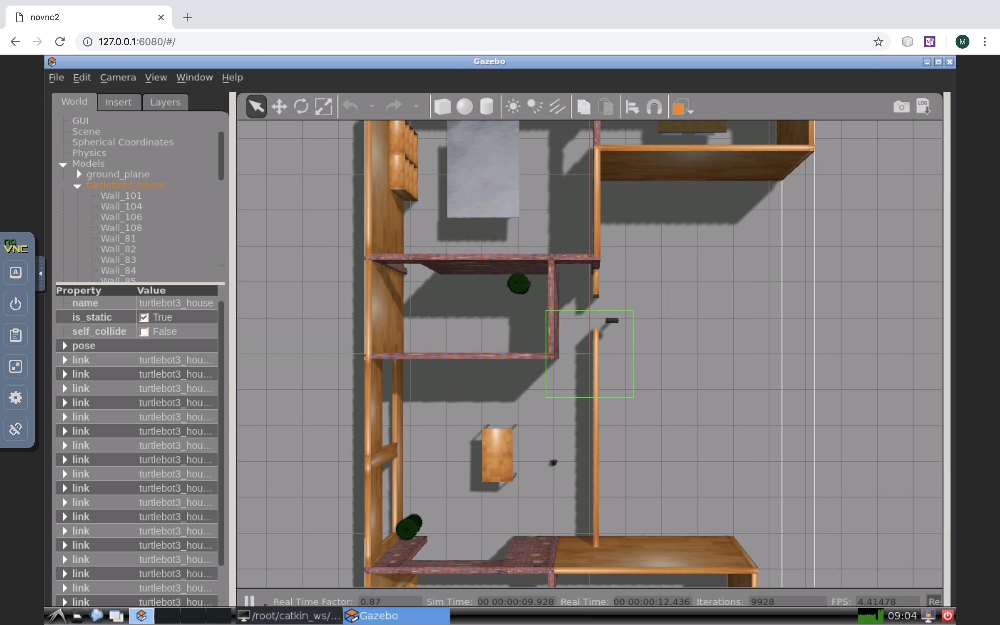

# ROS TurtleBot3 VNC Docker Image
This docker image is built for turtlebot3 developers. It's based on another docker image "[dorowu/ubuntu-desktop-lxde-vnc](https://github.com/fcwu/docker-ubuntu-vnc-desktop)", which provides HTML5 VNC interface to access Ubuntu 16.04 LXDE desktop environment.

## Install
### Pull from [Docker Hub](https://hub.docker.com/r/muchensun/ros_turtlebot3_vnc/)
You can pull the image by executing:

~~~
docker pull muchensun/ros_turtlebot3_vnc:v0.0
~~~

### Built image from local Dockerfile 
You can clone this repository, then built the image by executing:

~~~
docker build -t ros_turtlebot3_vnc:v0.0 .
~~~

## Run the image
You can run the image by:

~~~
docker run -e RESOLUTION=1280x800 -p 6080:80 muchensun/ros_turtlebot3_vnc:v0.0
~~~

Then browse [http://127.0.0.1:6080/](http://127.0.0.1:6080/)

## Test
Open terminal, then execute 

~~~
export TURTLEBOT3_MODEL=burger
roslaunch turtlebot3_gazebo turtlebot3_house.launch
~~~

You should see the following (first time launching might be slow)

## Reference
This work is finished in [DSLab](http://dslab.lzu.edu.cn/), Lanzhou University.
